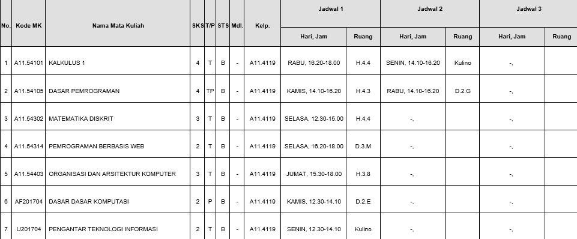

<!DOCTYPE html>
<html lang="en">
<head>
    
</head>
<body>
    <h1 align="center">Biodata Mahasiswa</h1>
    <table border="1" cellspacing="0" cellpadding="5" align="center" width="800">
        <tr align="center" bgcolor="#f70505">
            <td width="300">DATA DIRI</td>
            <td width="300">KETERANGAN</td>
            <td width="200">FOTO</td>
        </tr>
        <tr>
            <td>Nama</td>
            <td>Regan Caesar Suseno</td>
            <td rowspan="4"></td>
        </tr>
        <tr>
            <td>Kelas</td>
            <td>PemWeb.4119</td>
        </tr>
        <tr>
            <td>NIM</td>
            <td>A11.2022.14725</td>
        </tr>
        <tr>
            <td>Alamat</td>
            <td>Semarang</td>
        </tr>
    </table>
    <h1 align="center">JADWAL KRS</h1>
    <tr>
        img {
                display: block;
                margin-left: auto;
                margin-right: auto;
            }
        <td></td>
    </tr>
</body>
</html>
